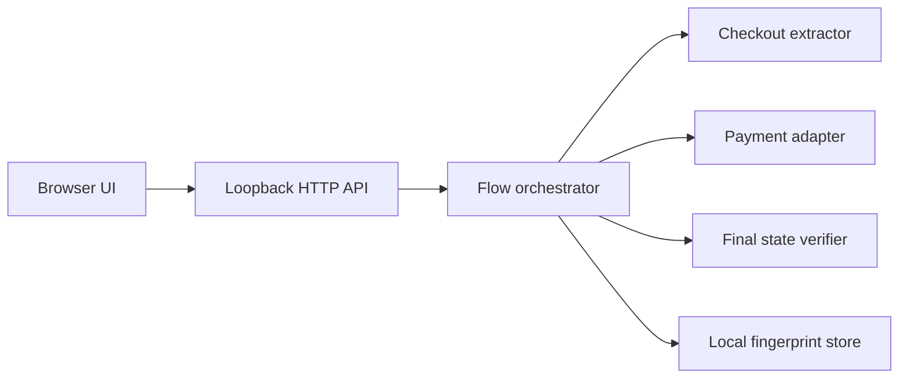

# Architecture

## Components

- `static/` renders the local control panel and mounts the browser-side payment
  component.
- `server.py` validates API payloads, runs tasks and exposes redacted status.
- `standalone_flow.py` separates proxy roles, performs read-only preflight and
  coordinates the state machine.
- `standalone_core/` contains transport, checkout, payment, fingerprint and
  parsing helpers.

## State model

The task result distinguishes these outcomes:

1. preflight or validation failure;
2. checkout created;
3. payment confirmation requested;
4. action required, including 3DS or redirect;
5. remote request accepted but final state pending;
6. final subscription or bound-card state verified;
7. terminal failure with the precise stage recorded.

Mutating requests use a no-replay boundary: once the remote mutation may have
started, a transport disconnect is reported as ambiguous rather than retried.

## Data boundaries

- Secrets enter from the local browser at runtime.
- The service does not use a project database.
- Local configuration, fingerprint cache, captures and logs are ignored by Git.
- Status output stores identifiers required for flow continuity but must remain
  redacted before publication.
- The static UI may persist drafts in localStorage; clearing repository files
  does not clear browser storage.
